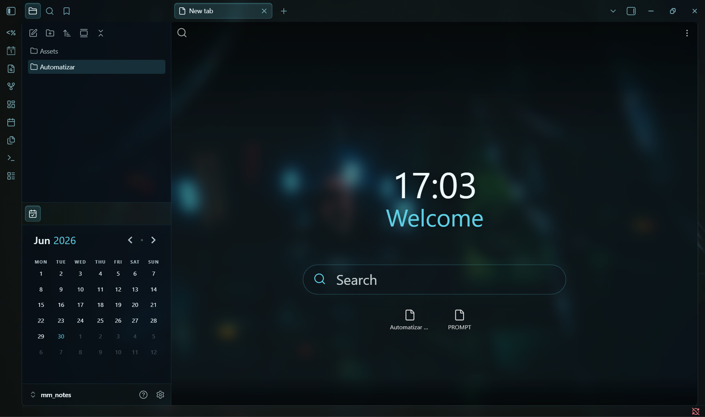

# Obsilain

A dark, neon-cyan, **full-glass** look for [Obsidian](https://obsidian.md) inspired by *Serial Experiments Lain*.

Obsilain is a **CSS snippet** that layers a frosted-glass, translucent UI (every panel blurs over your wallpaper) with a neon-cyan accent on top of the **Border** theme.

> It is a customization snippet, **not a standalone theme** — it builds on the Border theme and is best with a wallpaper of your choice.



> The wallpaper shown is the user's own; it is not distributed with this repo.

## Quick install (script)

Installs the Border theme + the snippet and enables them automatically. A timestamped backup of `.obsidian` is made first.

**Windows (PowerShell):**

```powershell
iwr https://raw.githubusercontent.com/danisotosol/obsilain/main/install.ps1 -OutFile install.ps1
powershell -ExecutionPolicy Bypass -File install.ps1            # pick your vault when prompted
# options:  -Beautitab   -Wallpaper "C:\path\to\image.jpg"
```

**macOS / Linux / Git-Bash:**

```bash
curl -fsSL https://raw.githubusercontent.com/danisotosol/obsilain/main/install.sh -o install.sh
bash install.sh                       # pick your vault when prompted
# options:  --beautitab   --wallpaper /path/to/image.jpg
```

The script does **not** download any wallpaper (use your own — see [Set your wallpaper](#set-your-wallpaper)). Pass `--wallpaper` / `-Wallpaper` to wire one in automatically. After it finishes, reload Obsidian (`Ctrl/Cmd+R`).

> Prefer doing it by hand? See [Install](#install) below.

## Requirements

- **Obsidian** (tested on 1.12.x).
- **Border** theme — `akifyss/obsidian-border` (install from *Settings → Appearance → Manage themes*). Obsilain overrides Border's surfaces to make them translucent + blurred.
- *(Optional)* **Beautitab** plugin — for the new-tab homepage (clock, greeting, search, recent files) seen in the screenshots.
- *(Optional)* **Style Settings** plugin — extra knobs from Border itself.

## Install

1. Install and select the **Border** theme.
2. Copy `lain-glass.css` into your vault's `.obsidian/snippets/` folder.
3. Enable it in *Settings → Appearance → CSS snippets → lain-glass*.
4. Set your wallpaper (below).

## Set your wallpaper

The wallpaper is **not bundled** (use your own image). Edit the `--lain-wp` variable at the top of `lain-glass.css`:

```css
:root,
body {
  /* pick ONE form: */
  --lain-wp: url("app://local/C:/absolute/path/to/your-wallpaper.jpg"); /* local file (desktop) */
  /* --lain-wp: url("https://example.com/wallpaper.jpg");               */ /* remote URL        */
  /* --lain-wp: url("data:image/jpeg;base64,....");                     */ /* embedded base64   */
}
```

For the homepage, set the same image as the Beautitab background (or leave Beautitab's background as *None* — this snippet makes its view transparent so the app wallpaper shows through).

## Tweak it

All knobs live in the `:root, body` block at the top:

| Variable | Default | What it does |
|----------|---------|--------------|
| `--lain-blur` | `12px` | Glass blur on main panels (lower = sharper wallpaper) |
| `--lain-blur-modal` | `44px` | Blur on modals / menus / command palette |
| `--lain-tint` | `rgba(8,18,26,0.32)` | Editor panel tint (higher alpha = more opaque = more readable) |
| `--lain-tint-strong` | `rgba(6,14,20,0.44)` | Sidebars / status bar tint |
| `--lain-tint-modal` | `rgba(8,18,26,0.22)` | Modals / search tint |
| `--lain-cyan` | `#5fd0e6` | Neon accent color |

If text is hard to read over busy wallpaper areas, raise `--lain-tint`. If it feels laggy, lower `--lain-blur`.

## Credits

- Built on the **Border** theme by [akifyss](https://github.com/Akifyss/obsidian-border) (MIT).
- Full-glass technique inspired by the **Blur** theme by [jawuj](https://github.com/jawuj/Blur-Theme).

## License

MIT — see [LICENSE](LICENSE).
